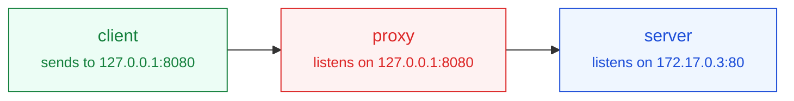

# 이 저장소에서 작업할 때의 규칙

Data Center Deep Dive — CS·데이터센터 인프라 기술 블로그.
Jekyll 로 만들고 GitHub Pages 가 `main` 브랜치를 그대로 빌드해 배포합니다.

---

## 다이어그램 (중요)

**본문의 주요 다이어그램은 손그림(hand-drawn) 스타일로 그립니다.** 이것이 이 블로그의 기본값입니다.
따로 요청이 없으면 항상 이 형식으로 만드세요.

Mermaid 11 의 `look: handDrawn` 을 쓰며, 설정은 `_includes/mermaid.html` 에 들어 있습니다.
글쓴이는 앞머리에 `mermaid: true` 만 넣으면 됩니다.

### 역할별 색 규칙

참고한 원본 그림과 같은 색 약속을 씁니다. 다이어그램마다 아래 `classDef` 네 줄을 그대로 넣고,
노드에 `class` 로 역할을 지정하세요.

| 역할 | class | 뜻 |
| --- | --- | --- |
| `client` | 초록 | 요청을 보내는 쪽 |
| `proxy` | 빨강 | 사용자 공간에서 연결을 대신 맺어주는 중개자 |
| `server` | 파랑 | 최종 목적지 |
| `kernel` | 빨간 점선 | 커널이 패킷을 고쳐 보내는 구간 (프로세스가 아님) |
| `zone` | 회색 점선 묶음 | 서로 다른 망을 묶는 `subgraph` (your machine, server side 등) |
| `note` | 테두리 없는 회색 글씨 | 점선 묶음 하단에 놓는 `* 누가 설정하는가` 한 줄 |



### 다이어그램 안의 글자는 영어로

**박스 이름, 설명, 화살표 라벨 — 다이어그램에 들어가는 글자는 전부 영어로 씁니다.**
본문이 한국어여도 그림만은 영어입니다.

- 한국어를 그대로 옮긴 어색한 영어가 되지 않게, **영어로 읽어서 자연스러운 표현**을 씁니다.
  참고한 원본 그림의 말투가 기준입니다:
  `sends data to 127.0.0.1:8080`, `listens on 172.17.0.3:80`,
  `kernel rewrites packets' destination address with 172.17.0.3:80`
- 박스 이름은 **소문자 한두 단어**가 기본 (`client`, `proxy`, `server`, `nginx`, `one server`).
  고유명사와 약어는 그대로 (`SOCKS proxy`, `SSH server`, `ToR switch`, `NIC`).
- 설명은 **동사로 시작하는 짧은 구**로 (`listens on ...`, `sends to ...`, `routes by ...`,
  `rewrites ... with ...`). 마침표로 끝내지 않습니다.
- 그림에 긴 설명을 욱여넣지 마세요. 그림은 뼈대만 보여주고,
  자세한 설명은 본문(한국어)에서 풉니다.

나쁜 예: `["방화벽 · 공유기가 목적지 주소를 바꿈"]`
좋은 예: `["firewall rewrites<br/>the destination address"]`

### 상자 안 내용은 최소로

상자에는 **이름 한 줄 + 꼭 필요한 값 한두 줄**만 넣습니다.
설명이 길어지면 그림이 읽히지 않습니다. 자세한 설명은 본문(한국어)에서 풉니다.

```
F["firewall<br/><small>rewrites the destination</small><br/><small>8000 &rarr; internal IP:8100</small>"]
S["server<br/><small>internal IP:8100</small>"]
C["client"]
```

### 망은 점선 사각형으로 묶기

`your machine`, `server side`, `remote network` 처럼 **어느 망에 있는지**를
`subgraph` 로 묶고 `zone` 클래스를 줍니다. 제목은 **한 줄로 짧게** — 길면 줄바꿈되어
상자에 가려 잘립니다.

```
subgraph SRV["server side"]
    F["firewall"] --> S["server"]
end
class SRV zone
```

⚠️ subgraph 에 **바깥 노드와 이어지는 선이 있으면 Mermaid 가 `direction` 을 무시합니다.**
안쪽 방향을 바꾸려 하지 말고, 바깥 `flowchart` 방향에 맞춰 쓰세요.

### 누가 설정하는가 — 상자 **밖** 바로 아래에

설정 주체는 **상자 안이 아니라 상자 밖 바로 아래**에 적습니다.
테두리 없는 텍스트 노드를 만들고, **설정 대상 상자와 같은 단(rank)에 강제로 놓습니다.**

```
subgraph SRV["server side"]
    F["firewall<br/><small>8000 &rarr; internal IP:8100</small>"] --> S["server"]
    NOTE["<small>* set by the network admin</small>"]
end
C --> F
C ~~~ NOTE        ← 이 줄이 핵심
class NOTE note
classDef note fill:none,stroke:none,color:#64748b
```

`C ~~~ NOTE` 로 **F 와 같은 단**에 놓이게 하는 것이 요령입니다.
`flowchart LR` 에서 같은 단은 같은 세로줄이므로, NOTE 가 F 바로 아래에 붙습니다.
아무 데도 잇지 않으면 레이아웃 엔진이 엉뚱한 곳에 놓고 점선 묶음만 커집니다.
`F ~~~ NOTE` 로 이으면 F 의 **오른쪽**으로 갑니다. 틀립니다.

- **다이어그램당 주석은 하나**로. 둘 이상이면 단 안의 위아래 순서를 제어할 수 없어
  위에 붙었다 아래에 붙었다 합니다.
- 문구는 한 줄로. `* set by the network admin`, `* set by client — ssh -D 9999`,
  `* set by the server operator`
- ⚠️ **반드시 `<small>` 로 감쌉니다.** 라벨이 `*` 로 시작하면 Mermaid 가 마크다운 목록으로
  읽어 `Unsupported markdown: list` 가 찍힙니다.

### legend 는 쓰지 않습니다

색과 점선의 뜻을 따로 설명하는 legend 다이어그램은 넣지 마세요.
망 이름과 `*` 한 줄이면 그림만 보고도 읽힙니다.

### 두 방식을 나란히 비교할 때

`subgraph` 두 개를 만들고 `PF ~~~ PX` 로 **위아래로 쌓습니다.**
그냥 두면 좌우로 놓여 폭이 터집니다.

### 폭 — 가로 스크롤은 금지

**어떤 화면 폭에서도 가로로 스크롤하지 않고 한눈에 보여야 합니다.**
그림은 판 폭에 맞춰 자동으로 줄어듭니다(`fitToPanel`). 그러니 **상자 수를 줄이는 것**이
유일한 대책입니다. LR 은 상자 4개까지, 그보다 길면 `TD`.

판은 본문(720px)보다 좌우로 넓게 잡되, 화면이 좁아지면 넓히는 양이 0 까지 자동으로
줄어듭니다(`--bleed: clamp(...)`). 이 값을 고정값으로 되돌리지 마세요. 중간 폭에서 넘칩니다.

### 알려진 함정

- 라벨이 `*` 로 시작하면 Mermaid 가 마크다운 목록으로 읽어 깨집니다. `<small>` 안에 넣으세요.
- subgraph 에 바깥 노드와 이어지는 선이 있으면 `direction` 이 무시됩니다.
- `<small>` 크기 규칙은 **전역**(`small { ... }`)으로 둬야 합니다. Mermaid 는 글자 폭을
  `.mermaid` 바깥의 임시 요소에서 재기 때문에, 선택자를 `.mermaid small` 로 좁히면
  잰 폭과 실제 폭이 달라져 글씨가 상자를 넘습니다.
- 글꼴이 내려오기 전에 그리면 같은 이유로 폭이 어긋납니다. **`document.fonts.ready` 만으로는
  부족합니다.** 아직 그 글꼴을 쓰는 요소가 없으면 받을 것이 없다고 보고 즉시 끝나버립니다.
  `document.fonts.load('400 16px Gaegu')` 로 명시적으로 불러온 뒤 `mermaid.run()` 을 부릅니다.

### 그릴 때 지킬 것

- `flowchart LR` 을 기본으로 쓰되 **박스는 4개까지**. 그보다 길어지면 `TD` 로 세로로 세웁니다.
  가로로 길면 휴대폰에서 옆으로 넘겨야 읽을 수 있습니다.
  (다이어그램은 본문보다 좌우 130px 씩 넓게 나오고, 700px 이하에서는 축소 대신 가로 스크롤입니다.)
- 위 역할 색은 **트래픽이 흐르는 그림**에 씁니다. 계층·분류처럼 흐름이 아닌 그림은
  색을 지정하지 말고 기본 모양 그대로 두세요. 억지로 역할을 붙이면 뜻이 흐려집니다.
- 박스 이름은 짧게(`client`, `nginx`, `SSH server`), 주소·포트 같은 설명은
  `<br/><small>...</small>` 로 아래 줄에 작게 붙인다. 원본 그림에서 박스 밑에 적힌 설명과 같은 역할.
- **다이어그램 안의 글씨는 예외 없이 손글씨(Gaegu)** 입니다. `<small>` 도 크기만 작아질 뿐
  글꼴은 같습니다. 일부만 고정폭으로 바꾸거나 하지 마세요.
- **라벨 안에 `http://` 같은 `://` 를 쓰지 않는다.** Mermaid 가 마크다운 링크로 잘못 읽어
  "Unsupported markdown: link" 가 찍힌다. `my-url` 처럼 스킴을 빼고 쓴다.
- 다이어그램은 흰 판 위에 올라가므로(`.mermaid` 스타일) 라이트·다크 모두 같은 색으로 보인다.
  색을 정할 때 다크 모드를 따로 고려하지 않아도 된다.

### 반듯한 기본 모양이 필요할 때

글쓴이가 명시적으로 요청하면, 그 글 앞머리에 아래를 넣어 기본 모양으로 되돌립니다.

```yaml
diagram_look: classic
```

---

## 말투 (중요)

글쓴이의 말투에 맞춥니다. 딱딱한 `~다.` 종결로 쓰지 마세요.

- 기본은 **존댓말** — "정리해보겠습니다", "보지 않습니다", "만들어집니다"
- 가끔 **독자에게 말을 겁니다** — "무엇이 다를까요?", "세워볼까요?", "그럼 못 재는 것은 무엇일까요?"
- 요점은 **체언으로 끊어** 리듬을 줍니다 — "가장 기본이 되는 형태.", "하나로 고정!"
- `~죠`, `~거든요`, `~고요` 같은 부드러운 종결을 섞되, 과하지 않게.

나쁜 예: "클라이언트가 할 일은 없다. 규칙은 장비에 박혀 있으므로 목적지는 하나로 고정이다."
좋은 예: "클라이언트가 할 일은 없습니다. 규칙은 장비에 박혀 있으니 **목적지는 하나로 고정**이고요."

`※` 부연 설명도 같은 말투로 씁니다.

---

## 글 쓰기

- 한국어 글은 `_posts/ko/YYYY-MM-DD-슬러그.md`, 영어 글은 `_posts/en/`.
  초안은 각각 `_drafts/ko/`, `_drafts/en/` (날짜 없이).
- **자동 번역은 없습니다.** 영어판은 직접 쓸 때만 생기고, `_posts/en/` 이 비어 있으면
  상단 English 링크가 자동으로 숨겨집니다.
- 주제(`category`)는 `_data/categories.yml` 에 있는 것만 씁니다:
  `cs` / `server-network` / `hpc` / `ai`. 주제를 늘리려면 그 파일에 항목을 추가하면
  홈 필터·Categories 메뉴·글 목록·배지 색까지 한꺼번에 반영됩니다.
- 대표 이미지(`cover`)를 지정하지 않으면 주제별 기본 그림이 자동으로 붙습니다.
  글 전용 그림이 필요하면 `assets/images/covers/` 에 16:9 SVG 로 만듭니다.
- 부연 설명은 문단 아래 `{: .note}` 를 붙여 작은 글씨로 답니다. `※` 로 시작합니다.
- 본문 첫 문단 뒤에 `<!--more-->` 를 넣으면 그 앞이 목록·RSS 요약이 됩니다.

자세한 것은 [WRITING.md](WRITING.md).

---

## 색과 스타일

- 사이트 팔레트는 `assets/css/style.scss` 맨 위 `:root` 한 곳에서 관리합니다.
  파랑 `#5B6CF9` → 보라 `#A855F7`, 포인트 하늘색 `#38BDF8`.
- 글꼴은 기기 기본 글꼴 스택을 씁니다. 본문용 웹폰트는 쓰지 않습니다.
  (다이어그램 손글씨 글꼴 `Gaegu` 만 예외이며, 다이어그램이 있는 글에서만 불러옵니다.)
- `.wrap` 과 같은 요소에 `padding` 축약형을 쓰면 좌우 여백이 0이 됩니다.
  세로 여백만 줄 때는 반드시 `padding-block` 을 쓰세요.

---

## 고치고 나서 확인할 것

로컬 빌드는 GitHub Pages 와 같은 Jekyll 3.x 로 돕니다.

```bash
bundle exec jekyll build --drafts   # 또는 serve --drafts
```

- 빌드가 통과하는지
- 390 / 1280px 에서 가로로 넘치지 않고 좌우 여백이 남는지
- 다이어그램이 있는 글이면 실제로 SVG 로 그려지는지 (오류 아이콘 0개)
- 내부 링크가 전부 살아 있는지

푸시하면 GitHub Actions 의 **Build check** 가 같은 빌드를 한 번 더 돌립니다.
