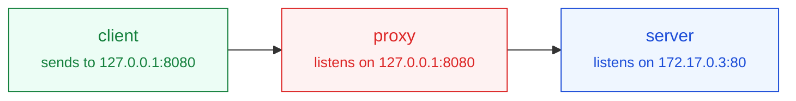

# 이 저장소에서 작업할 때의 규칙

Data Center Deep Dive — CS·데이터센터 인프라 기술 블로그.
Jekyll 로 만들고 GitHub Pages 가 `main` 브랜치를 그대로 빌드해 배포합니다.

---

## 다이어그램 (중요)

**본문의 주요 다이어그램은 손그림(hand-drawn) 스타일로 그립니다.** 이것이 이 블로그의 기본값입니다.
따로 요청이 없으면 항상 이 형식으로 만드세요.

Mermaid 11 의 `look: handDrawn` 을 쓰며, 설정은 `_includes/mermaid.html` 에 들어 있습니다.
글쓴이는 앞머리에 `mermaid: true` 만 넣으면 됩니다.

### 역할별 색 규칙

참고한 원본 그림과 같은 색 약속을 씁니다. 다이어그램마다 아래 `classDef` 네 줄을 그대로 넣고,
노드에 `class` 로 역할을 지정하세요.

| 역할 | class | 뜻 |
| --- | --- | --- |
| `client` | 초록 | 요청을 보내는 쪽 |
| `proxy` | 빨강 | 사용자 공간에서 연결을 대신 맺어주는 중개자 |
| `server` | 파랑 | 최종 목적지 |
| `kernel` | 빨간 점선 | 커널이 패킷을 고쳐 보내는 구간 (프로세스가 아님) |



### 그릴 때 지킬 것

- `flowchart LR` 을 기본으로. 흐름이 길면 `TD`.
- 박스 이름은 짧게(`client`, `nginx`, `SSH Server`), 주소·포트 같은 설명은
  `<br/><small>...</small>` 로 아래 줄에 작게 붙인다. 원본 그림에서 박스 밑에 적힌 설명과 같은 역할.
- **라벨 안에 `http://` 같은 `://` 를 쓰지 않는다.** Mermaid 가 마크다운 링크로 잘못 읽어
  "Unsupported markdown: link" 가 찍힌다. `my-url` 처럼 스킴을 빼고 쓴다.
- 다이어그램은 흰 판 위에 올라가므로(`.mermaid` 스타일) 라이트·다크 모두 같은 색으로 보인다.
  색을 정할 때 다크 모드를 따로 고려하지 않아도 된다.

### 반듯한 기본 모양이 필요할 때

글쓴이가 명시적으로 요청하면, 그 글 앞머리에 아래를 넣어 기본 모양으로 되돌립니다.

```yaml
diagram_look: classic
```

---

## 글 쓰기

- 한국어 글은 `_posts/ko/YYYY-MM-DD-슬러그.md`, 영어 글은 `_posts/en/`.
  초안은 각각 `_drafts/ko/`, `_drafts/en/` (날짜 없이).
- **자동 번역은 없습니다.** 영어판은 직접 쓸 때만 생기고, `_posts/en/` 이 비어 있으면
  상단 English 링크가 자동으로 숨겨집니다.
- 주제(`category`)는 `_data/categories.yml` 에 있는 것만 씁니다:
  `cs` / `server-network` / `hpc` / `ai`. 주제를 늘리려면 그 파일에 항목을 추가하면
  홈 필터·Categories 메뉴·글 목록·배지 색까지 한꺼번에 반영됩니다.
- 대표 이미지(`cover`)를 지정하지 않으면 주제별 기본 그림이 자동으로 붙습니다.
  글 전용 그림이 필요하면 `assets/images/covers/` 에 16:9 SVG 로 만듭니다.
- 부연 설명은 문단 아래 `{: .note}` 를 붙여 작은 글씨로 답니다. `※` 로 시작합니다.
- 본문 첫 문단 뒤에 `<!--more-->` 를 넣으면 그 앞이 목록·RSS 요약이 됩니다.

자세한 것은 [WRITING.md](WRITING.md).

---

## 색과 스타일

- 사이트 팔레트는 `assets/css/style.scss` 맨 위 `:root` 한 곳에서 관리합니다.
  파랑 `#5B6CF9` → 보라 `#A855F7`, 포인트 하늘색 `#38BDF8`.
- 글꼴은 기기 기본 글꼴 스택을 씁니다. 본문용 웹폰트는 쓰지 않습니다.
  (다이어그램 손글씨 글꼴 `Gaegu` 만 예외이며, 다이어그램이 있는 글에서만 불러옵니다.)
- `.wrap` 과 같은 요소에 `padding` 축약형을 쓰면 좌우 여백이 0이 됩니다.
  세로 여백만 줄 때는 반드시 `padding-block` 을 쓰세요.

---

## 고치고 나서 확인할 것

로컬 빌드는 GitHub Pages 와 같은 Jekyll 3.x 로 돕니다.

```bash
bundle exec jekyll build --drafts   # 또는 serve --drafts
```

- 빌드가 통과하는지
- 390 / 1280px 에서 가로로 넘치지 않고 좌우 여백이 남는지
- 다이어그램이 있는 글이면 실제로 SVG 로 그려지는지 (오류 아이콘 0개)
- 내부 링크가 전부 살아 있는지

푸시하면 GitHub Actions 의 **Build check** 가 같은 빌드를 한 번 더 돌립니다.
