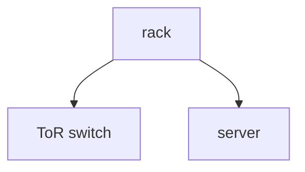

# 글 쓰는 법

30초 버전: **`_posts/ko/` 에 `2026-09-15-제목.md` 파일 하나 만들고, 앞머리 6줄 채우고, 커밋.**
1~2분 뒤에 https://ssyrc.github.io 에 올라옵니다.

---

## 1. 새 글 하나 올리기

파일 이름은 반드시 `YYYY-MM-DD-영문-슬러그.md` 형식입니다. 날짜가 없으면 글로 인식되지 않습니다.

```
_posts/ko/2026-09-20-rack-power-budget.md
```

파일 맨 위에 앞머리(front matter)를 넣습니다.

```yaml
---
title: "랙 하나의 전력 예산"
date: 2026-09-15
category: hpc
tags: [rack, power]
---
```

그 아래부터는 그냥 마크다운으로 쓰면 됩니다.
`_templates/` 안에 복사해서 쓸 수 있는 템플릿이 들어 있습니다
(`post-ko.md`, `post-en.md`).

가장 빠른 방법은 GitHub 웹에서 바로 만드는 것입니다:
저장소 → `_posts/ko` → **Add file** → **Create new file**.
휴대폰으로도 됩니다.

## 2. 앞머리에 넣을 수 있는 것

| 항목 | 필수 | 설명 |
| --- | --- | --- |
| `title` | ✅ | 글 제목 |
| `date` | ✅ | `2026-09-15` 형식 |
| `category` | 권장 | `cs` `server-network` `hpc` `ai` 중 하나 |
| `tags` | | `[rack, power]` 처럼 목록으로 |
| `ref` | | 한국어판·영어판을 잇는 열쇠말. 두 글에 같은 값을 넣으면 서로 링크됩니다 |
| `cover` | | 대표 이미지 경로. 안 넣으면 주제별 기본 그림이 자동으로 붙습니다 |
| `mermaid` | | `true` 면 Mermaid 다이어그램 기능을 불러옵니다 (시나리오 그림에는 필요 없습니다) |
| `diagram_look` | | `classic` 을 넣으면 손그림 대신 반듯한 기본 모양으로 그립니다 |
| `math` | | `true` 면 수식 기능을 불러옵니다 |
| `updated` | | 나중에 크게 고쳤을 때 `2026-10-01` 처럼 |

`lang` 은 적지 않아도 됩니다. `_posts/ko/` 에 있으면 한국어, `_posts/en/` 에 있으면 영어로 자동 처리됩니다.

## 3. 요약문

본문 중간에 `<!--more-->` 를 한 번 넣으면, 그 앞부분이 목록과 RSS 의 요약으로 쓰입니다.
안 넣으면 첫 문단이 요약이 됩니다.

## 4. 다이어그램

다이어그램은 두 가지가 있습니다.

### 시나리오 그림 (트래픽이 흐르는 그림)

**손으로 그린 SVG 를 생성기로 만들어 씁니다.** 이것이 기본값입니다.

1. `tools/diagrams/spec.js` 에 존과 상자를 적습니다. 좌표는 적지 않습니다.
2. `cd tools/diagrams && npm install && npm run build`
3. 본문에서 불러옵니다.

```liquid
<div class="diagram"></div>
```

`spec.js` 한 조각:

```js
{ title: 'server side',
  cols: [
    [{ kind:'kernel', title:'firewall', sub:'(ex) :8000 → 192.168.0.10:8100',
       note:'* set by the network admin' }],      // 주석은 상자 밖 바로 아래에 붙습니다
    [{ kind:'server', title:'server', sub:'(ex) 192.168.0.10:8100' }],
  ] }
```

- 역할별 색 — 초록 `client` 요청하는 쪽, 빨강 `proxy` 중개자, 파랑 `server` 목적지,
  빨간 점선 `kernel` 커널이 패킷을 고치는 구간.
- `sub` 는 **그 상자가 실제로 쓰는 주소 한 줄**. `(ex)` 를 붙이고, 문서용·사설 대역만 씁니다
  (`203.0.113.x`, `192.168.0.x`, `10.0.0.x`, `http://my-url`).
- `note` 는 **누가 설정하는지** 한 줄. 상자 안으로 옮기지 마세요.
- **다이어그램 안의 글자는 전부 영어로 씁니다.** 본문이 한국어여도 그림만은 영어입니다.

자세한 것은 [tools/diagrams/README.md](tools/diagrams/README.md).

### 계층·분류처럼 단순한 그림

앞머리에 `mermaid: true` 를 넣고 본문에 ```` ```mermaid ```` 블록을 쓰면 됩니다.
손그림 스타일로 그려지는 것이 기본값이고, 반듯한 기본 모양이 필요하면 `diagram_look: classic`.

````

````

- **라벨 안에 `http://` 를 쓰지 마세요.** 마크다운 링크로 잘못 읽혀 글자가 깨집니다. `my-url` 처럼 씁니다.
- 흐름이 아닌 그림에는 역할 색을 억지로 붙이지 않습니다.

## 5. 수식

앞머리에 `math: true` 를 넣으면 `$...$`(줄 안), `$$...$$`(별도 줄) 가 수식으로 보입니다.

## 6. 대표 이미지

모든 글에는 목록과 본문 맨 위에 쓰이는 대표 이미지가 붙습니다.
**아무것도 안 하면 주제별 기본 그림이 자동으로 들어갑니다.** 신경 쓰지 않아도 됩니다.

직접 지정하고 싶을 때만 앞머리에 한 줄 넣으세요.

```yaml
cover: /assets/images/covers/내-그림.svg
```

주제별 기본 그림은 `assets/images/covers/` 에 있습니다
(`topic-cs.svg`, `topic-server-network.svg`, `topic-hpc.svg`, `topic-ai.svg`).
바꾸고 싶으면 `_data/categories.yml` 의 `cover` 값을 고치면 됩니다.

### 글 전용 커버 만들기

커버는 **`tools/covers/` 의 생성기**로 만듭니다. 아이소메트릭 3D 에 영어 라벨을 붙인
화풍이고, 그 글에 실제로 나오는 장비를 본문 순서대로 세웁니다.

```bash
cd tools/covers && node gen.js ../../assets/images/covers
```

`gen.js` 의 `scenes` 에 항목을 하나 추가하면 그 이름으로 SVG 가 만들어집니다.
크기와 위치는 자동으로 맞춰지니 장면만 짜면 됩니다.
자세한 것은 [tools/covers/README.md](tools/covers/README.md).

**웹에서 이미지를 가져다 쓰지 마세요.** 데이터센터 도표는 대부분 스톡 이미지이거나
기업 자료라 블로그에 올릴 수 없습니다. 참고는 화풍까지만 하고 그림은 다시 그립니다.

### 본문 속 그림

```markdown

```

## 7. 영어판 (안 써도 됩니다)

**자동 번역은 없습니다.** 영어판을 올리고 싶으면 직접 써서 `_posts/en/` 에 넣어야 합니다.

`_posts/en/` 이 비어 있으면 상단의 **English 링크가 아예 보이지 않습니다.**
그러니 한국어만 쓰셔도 사이트는 완전히 정상이고, 빈 영어 페이지가 노출될 일도 없습니다.

나중에 영어 글을 한 편이라도 올리면 링크가 저절로 다시 생깁니다.
같은 글의 두 언어판은 `ref` 값으로 묶습니다.

- `_posts/ko/2026-09-20-rack-power-budget.md` → `ref: rack-power-budget`
- `_posts/en/2026-09-20-rack-power-budget.md` → `ref: rack-power-budget`

`ref` 가 같은 두 글 사이에는 서로 가는 링크가 자동으로 생깁니다.

## 8. 아직 공개하기 싫은 초안

`_drafts/` 에 넣어두면 사이트에 나오지 않습니다. 파일 이름에 날짜를 붙이지 않아도 됩니다.
다 쓰면 `_posts/ko/` 로 옮기면서 날짜를 붙이세요.

## 9. 주제 추가·수정

`_data/categories.yml` 한 파일만 고치면 홈의 필터, Categories 메뉴, 글 목록,
배지 색까지 한꺼번에 반영됩니다. 항목 하나에 `key`, 이름, 설명, `color`, `cover` 를 적으면 됩니다.

## 10. 로컬에서 미리 보기 (선택)

안 해도 됩니다. 커밋하면 GitHub 이 알아서 빌드합니다. 그래도 미리 보고 싶다면:

```bash
bundle install
bundle exec jekyll serve --drafts
# http://localhost:4000
```

커밋 전에 빌드가 깨지는지만 확인하고 싶다면 푸시 후 Actions 탭의
**Build check** 결과를 보면 됩니다. 초록색이면 사이트도 정상입니다.
