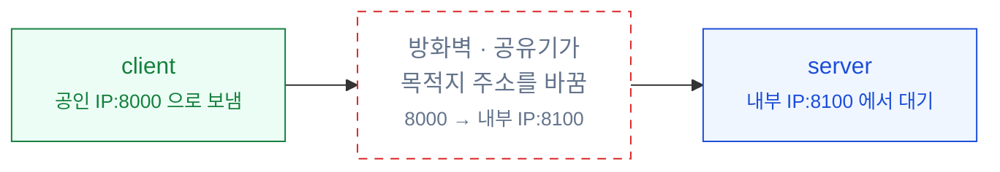
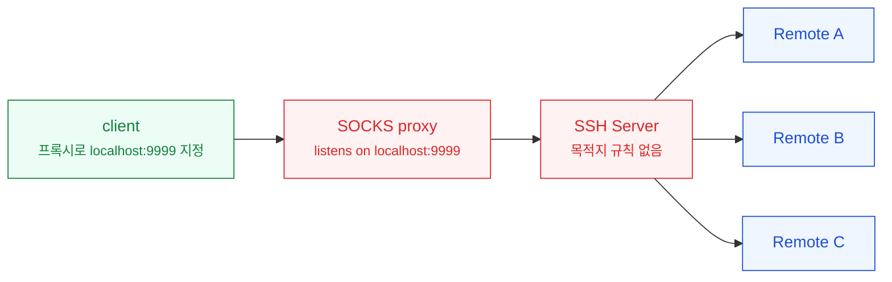
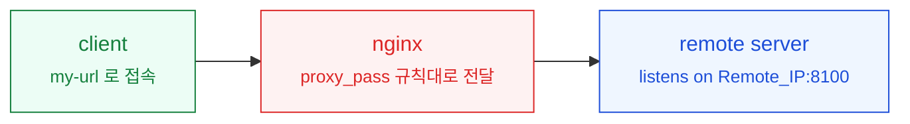

둘 다 "내 트래픽을 다른 곳으로 보낸다"는 점은 같은데, 무엇을 기준으로 갈리는지가
늘 헷갈렸다. 정리해보니 질문 두 개로 갈렸다.
**목적지를 언제 정하는가**, 그리고 **클라이언트가 중간 단계를 아는가**.

<!--more-->

## 1. 프록시와 포트 포워딩의 차이

**포트 포워딩**은 미리 못박아 둔 주소 한 쌍을 잇는 고정 통로다.
`A:포트로 오면 B:포트로 보낸다`는 규칙을 장비에 등록해두면, 그 뒤로는 패킷의
목적지 주소만 바꿔서 흘려보낸다. 안에 든 내용이 HTTP인지 무엇인지는 보지 않는다.

**프록시**는 연결을 대신 맺어주는 중개자다. 클라이언트와의 연결을 한 번 끊어서
받고, 자기가 새로 연결을 열어 목적지에 붙는다. 대신 맺어주는 쪽이므로
목적지가 요청마다 달라질 수 있고, 규약에 따라 내용을 들여다볼 수도 있다.

정리하면 이렇게 갈린다.

- 포트 포워딩 — 목적지가 **규칙을 등록하는 시점에** 정해진다
- 프록시 — 목적지가 **연결할 때마다** 정해질 수 있다

헷갈리는 이유는 이름 때문이다. 뒤에 나올 **Dynamic SSH port forwarding**은
이름이 포트 포워딩이지만, 실제로 만들어지는 것은 프록시다.

## 2. 포트 포워딩

### NAT 포트 포워딩

가장 기본이 되는 형태다. 클라이언트는 공인 주소의 특정 포트로 접속하고,
방화벽이나 공유기가 **설정해둔 규칙대로** 내부의 다른 IP:포트로 넘긴다.



클라이언트가 할 일은 없다. 그냥 공인 주소로 접속할 뿐이고, 자기 패킷이 도중에
다른 주소로 바뀌었다는 사실도 모른다. 규칙은 장비에 박혀 있으므로 **목적지는 하나로 고정**이다.

※ 이렇게 도착지 주소를 바꾸는 것을 DNAT(Destination NAT)라고 부른다. 공유기 설정 화면의 "포트 포워딩" 항목이 바로 이것이다.
{: .note}

### Dynamic SSH 포트 포워딩 (SOCKS 프록시)

SSH 한 줄이면 만들어진다.

```bash
ssh -D 9999 user@ssh-server
```

이 명령은 **내 컴퓨터에 SOCKS 프록시를 하나 띄운다.** 브라우저나 앱의 프록시
설정에 `localhost:9999`를 적어주면, 그때부터 그 앱의 트래픽은 SSH 터널을 타고
SSH 서버를 거쳐 목적지로 나간다.



여기서 짚을 점이 세 개 있다.

**사용자가 직접 지정한다.** 프록시 주소를 앱에 적어 넣는 것은 사용자다.
이렇게 클라이언트가 알고 쓰는 프록시를 **forward proxy**라고 한다.

**SSH 서버에는 목적지 규칙이 없다.** 어디로 보낼지 미리 적어두지 않는다.
SSH 서버 입장에서 특별히 해둘 설정이 없고, SSH가 떠 있기만 하면 된다.

**그래서 목적지가 고정되지 않는다.** `-D`의 D가 dynamic인 이유다.
어디로 갈지는 앱이 연결을 열 때마다 SOCKS 규약으로 알려주고, SSH 서버는
그 말을 듣고 그때그때 새로 연결을 맺는다. 위 그림에서 목적지가 여럿인 것이 이 뜻이다.

※ **SOCKS**는 "이 주소로 TCP 연결을 대신 맺어달라"고 부탁하는 규약이다. HTTP 프록시와 달리 내용물이 무엇인지 따지지 않아서 HTTP가 아닌 트래픽도 그대로 통과시킨다. 현재 쓰이는 판은 SOCKS5다.
{: .note}

※ `-L`(local)과 `-R`(remote) 포워딩은 명령을 칠 때 목적지를 함께 적어야 한다. 그래서 이 둘은 이름 그대로 목적지가 고정된 포트 포워딩이고, `-D`만 프록시가 된다.
{: .note}

## 3. Reverse proxy

방향이 반대다. 이번에는 **서버 쪽에** 중개자를 세운다.



클라이언트는 그냥 주소 하나로 접속할 뿐, 요청이 뒤에서 어떤 식으로 전달되는지
모른다. 어디로 넘길지는 **프록시 서버에 적어둔 규칙**이 정한다.

```nginx
server {
    listen 80;
    server_name my-url;

    location / {
        proxy_pass http://Remote_IP:8100;
    }
}
```

포트 포워딩과 달리 규칙을 주소 단위보다 잘게 쓸 수 있다.
`/api`는 이 서버로, `/`는 저 서버로 나누는 식이다. 패킷 주소만 바꾸는 것이 아니라
HTTP 요청을 이해하고 중개하기 때문이다.

※ forward proxy는 **클라이언트를 대신하고**, reverse proxy는 **서버를 대신한다**. 둘을 가르는 기준은 위치가 아니라 누구를 대리하느냐다.
{: .note}

## 4. 정리

| | NAT 포트 포워딩 | Dynamic SSH (SOCKS) | Reverse Proxy |
| --- | --- | --- | --- |
| 다루는 층 | 패킷 주소 | TCP 연결 중개 | HTTP 등 애플리케이션 |
| 목적지 결정 시점 | 규칙 등록 시 고정 | 연결할 때마다 | 프록시 규칙대로 |
| 설정하는 사람 | 방화벽·공유기 관리자 | 사용자 본인 | 서버 운영자 |
| 클라이언트가 아는가 | 모름 | 앎 (직접 지정) | 모름 |
| 누구를 대신하나 | 대신하지 않음 | 클라이언트 | 서버 |
| 예 | 공유기 포트 포워딩 | `ssh -D 9999` | nginx `proxy_pass` |

세 가지를 한 줄로 줄이면 이렇게 된다.

- **NAT 포트 포워딩** — 정해진 곳으로만 간다. 클라이언트는 모른다.
- **Dynamic SSH 포워딩** — 내가 정한 프록시를 거쳐 아무 데나 간다. 클라이언트가 안다.
- **Reverse proxy** — 서버가 정한 규칙대로 간다. 클라이언트는 모른다.
