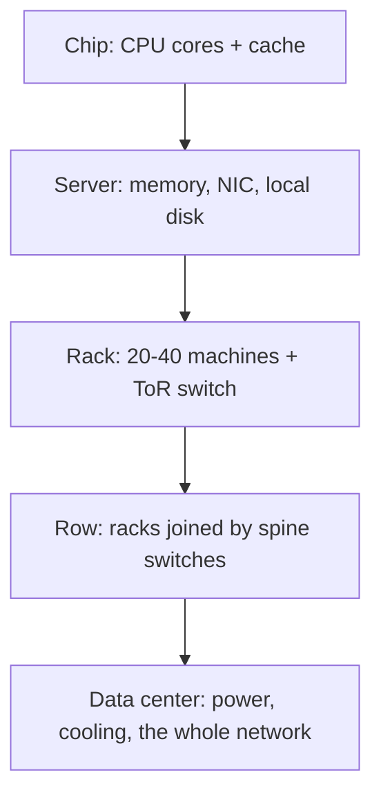

A lot of things that never quite made sense server by server fall into place
once the whole data center is treated as **a single large computer**. Before
writing anything else here, I want to lay out the ground plan from that angle.

<!--more-->

## The layers

A desktop connects CPU, memory and disk over a bus. A data center has the same
layers — the difference is that every step outward costs latency and gives up
bandwidth.

Walking down these layers, the same question comes up at every boundary:
**how much latency does crossing it add, how much bandwidth does it cost, and
how is failure contained on either side?**

## What each boundary costs

The exact numbers move with each hardware generation. The orders of magnitude
do not.

| Boundary | Rough latency | Order |
| --- | --- | --- |
| L1 cache | ~1 ns | 10⁰ |
| Local DRAM | ~100 ns | 10² |
| Server in the same rack (via ToR) | ~10 µs | 10⁴ |
| Another rack, same data center | ~100 µs | 10⁵ |
| Another region | ~10 ms | 10⁷ |

Each step down jumps two or three orders of magnitude. Most decisions in
distributed systems design — where data lives, what gets replicated, which
calls go asynchronous — are ways of avoiding this table.

## The plan

1. **Server architecture** — CPU, memory, storage, racks and chassis. How one machine is assembled.
2. **Networking** — ToR and spine, Clos topologies, oversubscription ratios.
3. **Power and cooling** — distribution paths, heat removal, efficiency metrics such as PUE.

Short notes first, gathered into longer posts once enough of them pile up.

## Reference

- Barroso, Hölzle, Ranganathan, *The Datacenter as a Computer*, 3rd ed. — where this framing comes from.
