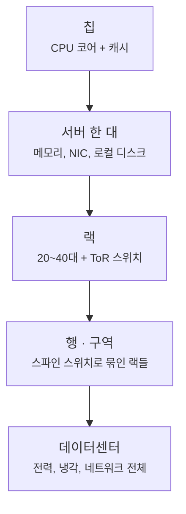

서버를 한 대씩 따로 보면 잘 이해되지 않던 것들이, 데이터센터 전체를
**하나의 큰 컴퓨터**로 놓고 보면 갑자기 설명이 되는 경우가 많습니다.
앞으로 이 블로그에서 정리해 나갈 순서를, 그 관점으로 먼저 잡아두겠습니다.

<!--more-->

## 계층으로 보면

데스크톱 한 대에 CPU·메모리·디스크가 버스로 연결되어 있듯, 데이터센터에도
같은 역할을 하는 계층이 있습니다. 다만 거리가 멀어질수록 지연이 커지고
대역폭이 줄어든다는 점이 다르죠.

이 계층을 따라 내려가면서 매번 같은 질문을 던지게 됩니다.
**이 경계를 넘을 때 지연은 얼마나 늘고, 대역폭은 얼마나 줄고,
고장은 어떻게 격리되는가?**

## 경계를 넘는 비용

숫자는 하드웨어 세대에 따라 달라지지만, 자릿수의 감각은 잘 바뀌지 않습니다.

| 경계 | 대략적인 지연 | 자릿수 |
| --- | --- | --- |
| L1 캐시 | ~1 ns | 10⁰ |
| 로컬 DRAM | ~100 ns | 10² |
| 같은 랙 안의 서버 (ToR 경유) | ~10 µs | 10⁴ |
| 같은 데이터센터의 다른 랙 | ~100 µs | 10⁵ |
| 다른 리전 | ~10 ms | 10⁷ |

한 칸 내려갈 때마다 두세 자릿수씩 뜁니다. 분산 시스템 설계에서 나오는
결정들 — 데이터를 어디에 두는지, 무엇을 복제하는지, 어떤 호출을
비동기로 돌리는지 — 은 결국 이 표를 피해 다니는 방법들이고요.

## 정리해 나갈 순서

1. **서버/네트워크** — CPU·메모리·스토리지와 랙·섀시에서 시작해,
   ToR과 스파인, 클로스 토폴로지, 오버서브스크립션 비율까지.
2. **HPC 인프라** — 클러스터 구성과 인터커넥트, 그리고 이를 떠받치는
   전력 분배 경로와 냉각. PUE 같은 효율 지표도 여기에 묶입니다.
3. **AI** — 학습·추론 워크로드가 위 구조에 실제로 어떤 부하를 주는지.

바닥의 **CS 기초** 는 필요할 때마다 따로 짚고 넘어가겠습니다.

## 참고

- Barroso, Hölzle, Ranganathan, *The Datacenter as a Computer*, 3rd ed. — 이 관점의 출발점이 된 책.
