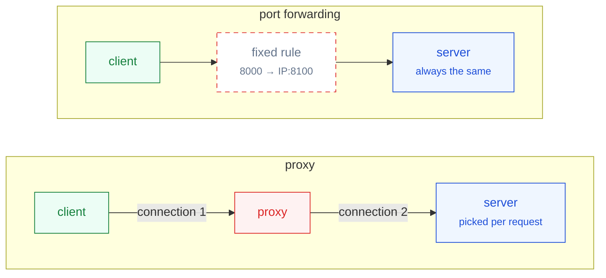
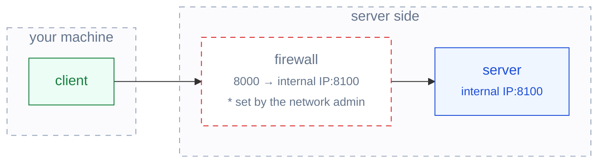
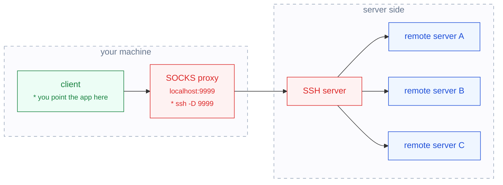
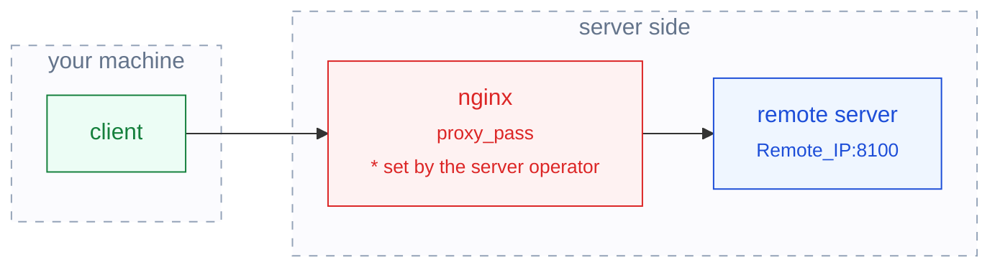

둘 다 "내 트래픽을 다른 곳으로 보낸다"는 점은 같은데, 무엇을 기준으로 갈리는지가
늘 헷갈렸습니다. 정리해보니 질문 두 개로 갈리더군요.
**목적지를 언제 정하는가**, 그리고 **클라이언트가 중간 단계를 아는가**.
하나씩 풀어보겠습니다.

<!--more-->

## 1. 프록시와 포트 포워딩의 차이

**포트 포워딩**은 미리 못박아 둔 주소 한 쌍을 잇는 고정 통로입니다.
`A:포트로 오면 B:포트로 보낸다`는 규칙을 장비에 등록해두면, 그 뒤로는 패킷의
목적지 주소만 바꿔서 흘려보냅니다. 안에 든 내용이 HTTP인지 무엇인지는 보지 않습니다.

**프록시**는 연결을 대신 맺어주는 중개자입니다. 클라이언트와의 연결을 한 번 끊어서
받고, 자기가 새로 연결을 열어 목적지에 붙습니다. 대신 맺어주는 쪽이니
목적지가 요청마다 달라질 수 있고, 규약에 따라 내용을 들여다볼 수도 있습니다.

그림으로 놓고 보면 중개하는 방식부터 다릅니다.



위쪽은 연결이 **하나**입니다. 클라이언트가 연 연결이 목적지 주소만 바뀐 채
그대로 서버까지 갑니다. 아래쪽은 연결이 **둘**이고요. 프록시가 클라이언트의 연결을
자기가 받아 끝내고, 목적지로는 새 연결을 따로 엽니다. 이 한 번 끊고 다시 잇는
동작 덕분에 프록시는 어디로 보낼지 그때그때 고를 수 있습니다.

정리하면 이렇게 갈립니다.

- 포트 포워딩 — 목적지가 **규칙을 등록하는 시점에** 정해집니다. 하나로 고정!
- 프록시 — 목적지가 **연결할 때마다** 정해질 수 있습니다.

헷갈리는 이유는 이름 때문입니다. 뒤에 나올 **Dynamic SSH port forwarding**은
이름이 포트 포워딩이지만, 실제로 만들어지는 것은 프록시거든요.

## 2. 포트 포워딩

### NAT 포트 포워딩

가장 기본이 되는 형태. 클라이언트는 공인 주소의 특정 포트로 접속하고,
방화벽이나 공유기가 **설정해둔 규칙대로** 내부의 다른 IP:포트로 넘겨줍니다.



클라이언트가 할 일은 없습니다. 그냥 공인 주소로 접속할 뿐이고, 자기 패킷이 도중에
다른 주소로 바뀌었다는 사실도 모릅니다. 규칙은 장비에 박혀 있으니
**목적지는 하나로 고정**이고요.

※ 이렇게 도착지 주소를 바꾸는 것을 DNAT(Destination NAT)라고 부릅니다. 공유기 설정 화면의 "포트 포워딩" 항목이 바로 이것입니다.
{: .note}

### Dynamic SSH 포트 포워딩 (SOCKS 프록시)

SSH 한 줄이면 만들어집니다.

```bash
ssh -D 9999 user@ssh-server
```

이 명령은 **내 컴퓨터에 SOCKS 프록시를 하나 띄웁니다.** 브라우저나 앱의 프록시
설정에 `localhost:9999`를 적어주면, 그때부터 그 앱의 트래픽은 SSH 터널을 타고
SSH 서버를 거쳐 목적지로 나갑니다.

그럼 그 "프록시 설정"은 어디에 적어주면 될까요?

- **Firefox** — 설정 → 네트워크 설정 → **수동 프록시 설정** → SOCKS 호스트에 `localhost`, 포트에 `9999`, **SOCKS v5** 선택. 브라우저 자체 설정이라 파이어폭스만 터널을 탑니다.
- **Chrome** — 프록시 설정 화면이 따로 없고 운영체제 설정을 그대로 따릅니다. 크롬만 따로 태우려면 실행 옵션을 주세요. `chrome --proxy-server="socks5://localhost:9999"`
- **MobaXterm** — Tools → MobaSSHTunnel → New SSH tunnel → **Dynamic port forwarding (SOCKS proxy)** 선택 → 로컬 포트 `9999`와 SSH 서버 정보를 넣고 Start. `ssh -D` 를 창으로 하는 것과 같습니다.
{: .note}

※ Firefox 에는 "SOCKS v5 사용 시 DNS도 프록시 사용" 체크박스가 있습니다. 이걸 켜야 주소를 찾는 것까지 터널을 탑니다. 안 켜면 내 컴퓨터에서 DNS를 물어보게 되어, 내부망 주소가 안 풀리거나 어디에 접속하려 했는지가 밖으로 드러납니다.
{: .note}



여기서 짚을 점이 세 개 있습니다.

**사용자가 직접 지정합니다.** 프록시 주소를 앱에 적어 넣는 것은 사용자입니다.
이렇게 클라이언트가 알고 쓰는 프록시를 **forward proxy**라고 부릅니다.

**SSH 서버에는 목적지 규칙이 없습니다.** 어디로 보낼지 미리 적어두지 않습니다.
SSH 서버 입장에서 특별히 해둘 설정이 없고, SSH가 떠 있기만 하면 됩니다.

**그래서 목적지가 고정되지 않습니다.** `-D`의 D가 dynamic인 이유죠.
어디로 갈지는 앱이 연결을 열 때마다 SOCKS 규약으로 알려주고, SSH 서버는
그 말을 듣고 그때그때 새로 연결을 맺습니다. 위 그림에서 목적지가 여럿인 것이 이 뜻입니다.

※ **SOCKS**는 "이 주소로 TCP 연결을 대신 맺어달라"고 부탁하는 규약입니다. HTTP 프록시와 달리 내용물이 무엇인지 따지지 않아서, HTTP가 아닌 트래픽도 그대로 통과시킵니다. 지금 쓰이는 판은 SOCKS5입니다.
{: .note}

※ `-L`(local)과 `-R`(remote) 포워딩은 명령을 칠 때 목적지를 함께 적어야 합니다. 그래서 이 둘은 이름 그대로 목적지가 고정된 포트 포워딩이고, `-D`만 프록시가 됩니다.
{: .note}

## 3. Reverse proxy

이번엔 방향이 반대입니다. **서버 쪽에** 중개자를 세워볼까요?



클라이언트는 그냥 주소 하나로 접속할 뿐, 요청이 뒤에서 어떤 식으로 전달되는지
모릅니다. 어디로 넘길지는 **프록시 서버에 적어둔 규칙**이 정합니다.

```nginx
server {
    listen 80;
    server_name my-url;

    location / {
        proxy_pass http://Remote_IP:8100;
    }
}
```

포트 포워딩과 달리 규칙을 주소 단위보다 잘게 쓸 수 있습니다.
`/api`는 이 서버로, `/`는 저 서버로 나누는 식이죠. 패킷 주소만 바꾸는 것이 아니라
HTTP 요청을 이해하고 중개하기 때문입니다.

※ forward proxy는 **클라이언트를 대신하고**, reverse proxy는 **서버를 대신합니다**. 둘을 가르는 기준은 위치가 아니라 누구를 대리하느냐입니다.
{: .note}

## 4. 정리

| | NAT 포트 포워딩 | Dynamic SSH (SOCKS) | Reverse Proxy |
| --- | --- | --- | --- |
| 다루는 층 | 패킷 주소 | TCP 연결 중개 | HTTP 등 애플리케이션 |
| 목적지 결정 시점 | 규칙 등록 시 고정 | 연결할 때마다 | 프록시 규칙대로 |
| 설정하는 사람 | 방화벽·공유기 관리자 | 사용자 본인 | 서버 운영자 |
| 설정하는 곳 | 공유기·방화벽 설정 화면 | `ssh -D` + 앱의 프록시 설정 | `nginx.conf` |
| 클라이언트가 아는가 | 모름 | 앎 (직접 지정) | 모름 |
| 누구를 대신하나 | 대신하지 않음 | 클라이언트 | 서버 |

세 가지를 한 줄로 줄이면 이렇게 됩니다.

- **NAT 포트 포워딩** — 정해진 곳으로만 갑니다. 클라이언트는 모릅니다.
- **Dynamic SSH 포워딩** — 내가 정한 프록시를 거쳐 아무 데나 갑니다. 클라이언트가 압니다.
- **Reverse proxy** — 서버가 정한 규칙대로 갑니다. 클라이언트는 모릅니다.
